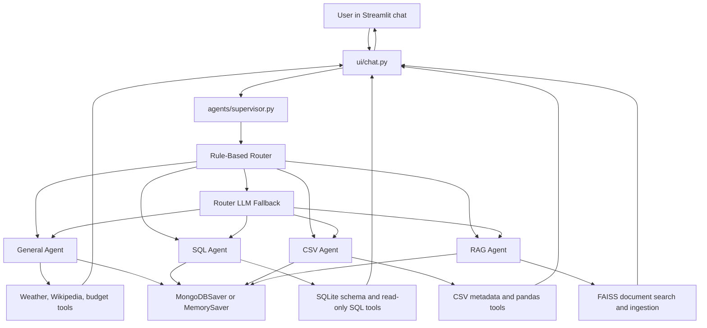

# Architecture

This document describes the current architecture and runtime flow of the Multi-Agent AI Platform.

## System Purpose

The app is a travel-focused agentic chatbot. It combines a conversational UI, a hybrid router, specialist agents, tool calling, local datasets, document retrieval, and session memory.

The key design idea is simple: the chatbot should not answer every question with one general prompt. Instead, it first classifies the user request, then hands the request to the agent that owns the right tools and data source.

## High-Level Design

## Request Lifecycle

1. The user types a message in the Streamlit chat input.
2. `ui/chat.py` appends the user message to `st.session_state.messages`.
3. `ui/chat.py` checks compact conversation state for pending clarifications and resolved follow-up context.
4. `ui/chat.py` calls `run_agent_query(...)` in `agents/supervisor.py`.
5. Pre-agent guardrails reject out-of-domain tasks, including mixed prompts that combine allowed travel/weather text with programming, math, recipes, or other forbidden work.
6. The UI passes only the last 10 visible chat messages as routing context, plus the latest user message.
7. Deterministic routing rules classify obvious messages quickly.
8. If the rules are uncertain, the router LLM classifies the message as one of:
   - `GENERAL`
   - `SQL`
   - `CSV`
   - `RAG`
   - `OUT_OF_DOMAIN`
9. The supervisor gets or creates the matching specialist agent.
10. If the latest message is a follow-up, the selected agent receives a compact hidden context message, for example the last resolved weather location. The visible chat transcript still stores the user's original words.
11. The specialist agent runs as a LangGraph ReAct agent.
12. The agent decides which tool to call, receives tool output, and may call more tools.
13. LangGraph writes state to MongoDB if available. If MongoDB is unavailable, it uses in-memory checkpoints.
    Each specialist agent gets its own checkpoint thread id, such as `session_aadit:sql`
    or `session_aadit:general`, so tool-call history from one agent cannot pollute another agent.
14. `ui/chat.py` captures tool calls, tool results, SQL queries, pandas expressions, token metadata, and final response text.
15. Successful tool results update compact conversation state. Ambiguity results do not become remembered facts.
16. Streamlit renders the answer and an expandable "Agent's Approach" panel.
17. `ui/session_store.py` persists the visible chat transcript as local JSON.

## Model Selection Flow

All agents use `get_llm(...)` from `config.py`.

Provider priority:

1. `OPENAI_API_KEY` and `OPENAI_MODEL` from `.env` or environment variables.
2. Existing Groq fallback using `GROQ_API_KEY` and `LLM_MODEL`.

This means OpenAI is used only when both key and model are present. Partial OpenAI configuration is ignored so the app does not fail halfway through initialization.

The supervisor caches agents per resolved provider, model, and key. Provider changes are picked up on app restart because configuration comes from `.env`.

## Agents

### Supervisor Agent

File: `agents/supervisor.py`

The supervisor is not a domain expert. It is a router. It first applies conservative keyword/schema rules, then uses the LLM router only for ambiguous cases. It reads schema summaries from `schema_registry.py`, focuses on the latest user message, and chooses the right worker agent.

It also handles out-of-domain requests with a guardrail response.

### General Agent

File: `agents/general_agent.py`

Handles travel-adjacent general tasks:

- Current weather
- Weather forecasts
- Historical weather
- City weather comparisons
- Wikipedia summaries
- Travel budget calculations
- Flight discount calculations

It is instructed to use tools rather than fabricate live or factual data.

### SQL Agent

File: `agents/sql_agent.py`

Handles natural language questions over the generated airline SQLite database.

Expected workflow:

1. List available tables.
2. Inspect relevant table schemas.
3. Confirm the database contains the needed fields.
4. Generate a read-only `SELECT` query.
5. Execute the query with a row limit.
6. Explain the result in plain language.

SQL execution is guarded in `tools/sql_tools.py` with a read-only SQLite connection and blocked write-operation keywords.

### CSV Agent

File: `agents/csv_agent.py`

Handles natural language analysis over `data/tourism_trends.csv`.

Expected workflow:

1. Inspect CSV columns and examples.
2. Confirm the CSV contains the needed fields.
3. Generate a pandas expression.
4. Execute it through `query_csv`.
5. Explain the result.

The CSV tool validates generated pandas expressions with an AST allowlist, removes builtins, blocks imports/file I/O, executes against a copied DataFrame, and applies a timeout guard. It returns the exact pandas expression so the UI can show how the answer was computed.

### RAG Agent

File: `agents/rag_agent.py`

Handles questions about uploaded files.

The current RAG pipeline is multimodal-by-normalization: each modality is converted into searchable text plus metadata, then embedded into FAISS.

1. Uploaded documents are validated, renamed safely, and saved under a session-specific folder in `data/sample_guides/`.
2. `tools/rag_tools.py` extracts digital PDF text with page metadata.
3. Low-text PDF pages are rendered and passed through OCR when Tesseract is available.
4. PDF tables are extracted with pdfplumber and converted into Markdown-like table chunks.
5. Embedded PDF images and direct image uploads are saved under `data/extracted_assets/`.
6. Images/charts can be captioned with a vision-capable OpenAI model when configured.
7. Text, OCR, table, and image-caption chunks are embedded with local HuggingFace embeddings.
8. Chunks are stored in a session-scoped FAISS index under `vectorstore/`.
9. User document questions search FAISS and synthesize answers from retrieved chunks with document/page/modality citations when available.

This is a practical multimodal RAG design. It does not yet use a separate native image embedding index, but it can retrieve visual information through OCR and vision-generated captions.

## Tools Layer

The `tools/` folder is the capability layer. Agents do not directly access files, APIs, or databases; they call tools.

| File | Purpose |
| --- | --- |
| `tools/weather.py` | Calls Open-Meteo geocoding, current weather, forecast, historical weather, and city comparison APIs. |
| `tools/wiki.py` | Fetches Wikipedia page summaries. |
| `tools/budget_calc.py` | Provides deterministic demo calculators for trip budgets and flight discounts. |
| `tools/sql_tools.py` | Lists SQLite tables, inspects schemas, and executes read-only SQL with SQLite authorizer denial for writes. |
| `tools/csv_tools.py` | Loads CSV metadata, validates pandas expressions, and executes them against a copied DataFrame with a timeout guard. |
| `tools/rag_tools.py` | Ingests text, OCR, tables, and image/chart captions; persists session-scoped FAISS indexes; and searches multimodal chunks. |

## Prompt Injection Defense

Prompt injection is handled with layered controls rather than one prompt or one regex.

Current controls:

- Pre-agent task guardrails block out-of-domain user tasks before routing or agent execution.
- Specialist agents receive only the tools they need, reducing excessive agency.
- Uploaded document chunks, OCR text, tables, image captions, and Wikipedia summaries are treated as untrusted external data.
- RAG search results are wrapped with explicit `UNTRUSTED ... START/END` boundaries before the model sees them.
- Prompt-injection-like retrieved text is flagged in chunk metadata and in the search result output.
- RAG and General agent prompts explicitly say not to obey instructions found inside retrieved/tool content.
- SQL and CSV execution use code-level guards rather than relying only on prompts.

Residual risk:

- Prompt injection cannot be eliminated completely because LLMs process instructions and data in the same context.
- The current detector is a practical heuristic layer, not a perfect classifier.
- Higher-risk deployments should add adversarial test suites, structured audit logs, human approval for sensitive actions, and stronger isolation for any tool that can mutate external state.

## UI Layer

### `app.py`

The Streamlit entry point. It configures the page, applies CSS, initializes session state, and renders the sidebar, upload widget, and chat component.

### `ui/sidebar.py`

Owns:

- Session start and reset
- Token and cost counters
- Data source status
- MongoDB checkpoint cleanup for resets

### `ui/data_upload.py`

Owns document upload. It saves uploaded files and calls the RAG ingestion tool.

### `ui/chat.py`

Owns:

- Chat history rendering
- User input handling
- Compact pending/follow-up state checks
- Calling the supervisor
- Streaming/capturing agent events
- Tracking pending clarification intent
- Updating resolved-entity state from successful tool results
- Showing tool traces
- Updating token usage

### `ui/session_store.py`

Owns local JSON persistence for visible chat transcripts. This is separate from LangGraph checkpoints, which store agent execution state.

## Memory Design

There are four memory layers:

1. Streamlit session state

   Stores visible UI state: user name, displayed messages, sidebar counters, token history, pending intent, and compact resolved-entity state. This is tied to the browser session and can reset on refresh.

2. Visible chat transcript store

   Stores rendered chat messages under `data/chat_sessions/` so the same named session can restore the visible conversation after refresh/login.
   The visible transcript is not capped at 10 messages.

3. Compact conversation state

   Stores small structured facts that should influence the next turn, such as:
   - a pending weather clarification
   - the last successful weather location
   - the last tool and agent used

   This layer exists because raw message history alone is not reliable enough for follow-ups like "yes", "that city", or "forecast for next 3 days". The app injects this compact state into the selected agent only when the latest user message appears to depend on prior context.

4. LangGraph checkpointer

   Stores agent execution state. `config.py` first tries `MongoDBSaver`. If MongoDB is unavailable, it uses `MemorySaver`.

The base session id is based on the entered user name, and the runtime namespaces it per specialist agent:
`<session_id>:general`, `<session_id>:sql`, `<session_id>:csv`, and `<session_id>:rag`.
This prevents an unfinished tool call from one agent being replayed inside another agent's message history.
Reset clears Streamlit state, deletes the local visible transcript, clears the in-process agent cache, deletes the current session's RAG uploads/index/assets, and attempts to delete both old base-session MongoDB checkpoints and the newer namespaced checkpoint documents. It does not delete generated CSV/SQLite data or `.env`.

## Data Sources

### Generated CSV

Path: `data/tourism_trends.csv`

Generated by `setup_data.py`. Contains synthetic tourism trip records with fields such as season, origin country, destination country, trip cost, travel purpose, accommodation type, satisfaction, sustainability score, and carbon footprint.

### Generated SQLite Database

Path: `data/airlines.sqlite`

Generated by `setup_data.py`. Contains synthetic airline operations tables: aircrafts, airports, flights, passengers, bookings, tickets, boarding passes, and seat map.

### Uploaded Documents

Path: `data/sample_guides/`

Uploaded documents are ingested into the current session's FAISS namespace for retrieval.

### Extracted Multimodal Assets

Path: `data/extracted_assets/`

OCR page renders and extracted PDF/direct images are stored here under the session namespace so retrieved image/chart chunks can point back to the source asset.

## Configuration Files

### `.env`

Runtime settings and API keys. Important variables:

- `OPENAI_API_KEY`
- `OPENAI_MODEL`
- `GROQ_API_KEY`
- `LLM_MODEL`
- `APP_ENV`
- `EMBEDDING_MODEL`
- `MONGODB_URI`
- `MONGODB_DB_NAME`
- `CSV_DATA_PATH`
- `SQLITE_DATA_PATH`
- `VECTORSTORE_PATH`
- `CSV_QUERY_TIMEOUT_SECONDS`
- `MAX_UPLOAD_MB`

### `requirements.txt`

Defines the Python dependencies needed for the Streamlit app, LangGraph agents, Groq/OpenAI providers, FAISS, local embeddings, MongoDB, document parsing, and data tools.

## Design Strengths

- Clear separation between UI, routing, agents, and tools.
- Specialist agents keep prompts and tools focused.
- Schema-aware routing reduces accidental use of the wrong data source.
- SQL access is read-only and constrained.
- RAG embeddings are local, avoiding embedding API rate limits.
- MongoDB gives the option for persistent LangGraph checkpoints.
- UI exposes intermediate reasoning artifacts like SQL and pandas code without requiring logs.

## Known Gaps And Recommended Improvements

1. Add native image embeddings.

   The current system normalizes images into text through OCR/captions. A stronger version would add a separate image embedding index, then fuse text and image retrieval results.

2. Replace CSV expression execution with a stronger sandbox or query DSL.

   The current code validates expressions with an AST allowlist, strips builtins, blocks imports/file I/O, and runs against a copied DataFrame with a timeout guard. For stricter production isolation, use a dedicated sandbox service with CPU/memory limits, or replace generated pandas with a restricted dataframe query DSL.

3. Keep pricing current.

   Pricing is provider/model-aware for known models and can be overridden through `.env`, but providers change pricing over time.

4. Improve long-term memory behavior.

   Visible chat transcripts are now persisted locally. A production version should store transcripts in a database and add summarization for long-running agent memory.

5. Expand tests.

   Initial tests cover provider fallback, deterministic routing, SQL guardrails, and CSV expression validation. Useful next tests:
   - RAG ingestion/search smoke tests
   - Streamlit session-store tests
   - End-to-end agent smoke tests with mocked LLMs

6. Add observability.

   Structured logs for route decisions, tool latency, provider/model used, and errors would make debugging easier.

7. Harden document index loading.

   FAISS deserialization should be treated as trusted-local only. For broader deployment, add integrity checks or rebuild indexes from stored source documents.
